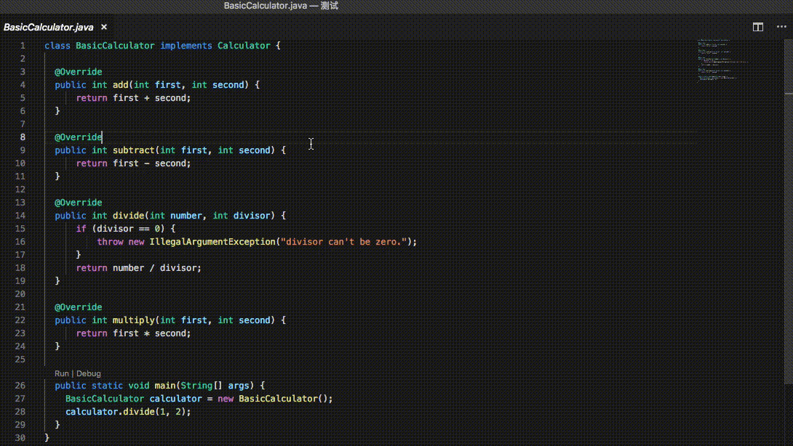
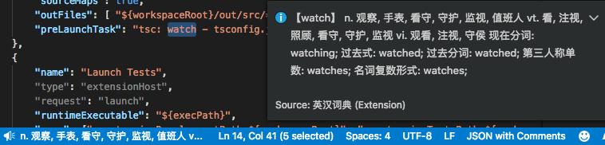
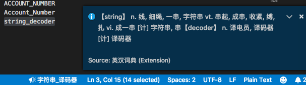
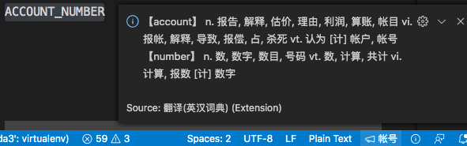
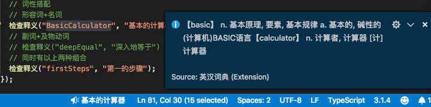
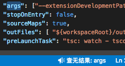
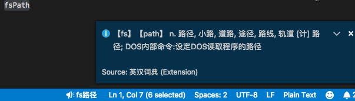
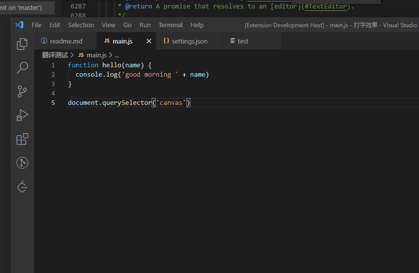

# 英汉词典使用说明

- 在状态栏中显示选中词的释义，支持驼峰和下划线命名查询
- 运行“批量翻译标识符”，批量翻译当前文件中被识别出的标识符，打开并列编辑器并显示翻译后内容

## 功能

点击状态栏显示更全信息。当选中单词时，详细信息包括词形变化；当选中驼峰或下划线命名时，详细信息包括所有单词的释义，但不包括各词的词形变化。

词典数据源于 [ECDICT](https://github.com/skywind3000/ECDICT)。由于数据较大，插件加载时需几秒。之后的查询不需再次载入。

- 批量翻译识别出的命名：

- 查询单词：

- 查询驼峰命名：

- 查询下划线命名：

- 短语优先：

如果下划线命名是固定短语，则采用短语释义

- 优先形容词+名词组合：

- 查无结果：

- 悬停显示翻译结果：

## 配置项

|键名称|默认值|说明|
|:-:|:-:|:-:|
|EnglishChineseDictionary.enableHover|false|开启悬停显示翻译结果|

## 版本说明

### 0.0.11

- 对某些常用命名进行翻译改进，如"eventListener"原译为"事件收听者"，现译为"事件监听器"
- 优先使用直接匹配的短语释义，如"ACCOUNT_NUMBER"："帐户_数字" -> "帐号"
- 避免某些释义中出现的省略号，如"beforeRedesign"："在...之前重新设计" -> "在重新设计之前"

### 0.0.8

[VS Code英汉词典v0.0.8：批量翻译文件部分命名](https://zhuanlan.zhihu.com/p/53288297)

### 0.0.7

中文编程[知乎专栏](https://zhuanlan.zhihu.com/codeInChinese)文章：[VS Code英汉词典插件v0.0.7-尝试词性搭配](https://zhuanlan.zhihu.com/p/51525136)
- 优先形容词+名词组合：如命名中包含两个词，前一个有形容词义，后一个有名词义，这两个词义优先。如"BasicCalculator"，原为"基本原理计算器"。现为"基本的计算器"
- 如命名中包含现在分词，取原型的释义

### 0.0.6

中文编程[知乎专栏](https://zhuanlan.zhihu.com/codeInChinese)文章：[VS Code英汉词典插件v0.0.6-改为TS实现，加测试](https://zhuanlan.zhihu.com/p/51243255)
- 如命名中包含复数词汇，取原型的释义。如useColors，colors意为"国旗"，现改为取'color'释义.

### 0.0.4

中文编程[知乎专栏](https://zhuanlan.zhihu.com/codeInChinese)文章：[VS Code英汉词典插件v0.0.4-驼峰下划线命名](https://zhuanlan.zhihu.com/p/49133480)
- 对驼峰和下划线命名中所有单词进行直译
- 查词无结果时提示

### 0.0.1

中文编程[知乎专栏](https://zhuanlan.zhihu.com/codeInChinese)文章：[Visual Studio Code插件-英汉词典初版发布](https://zhuanlan.zhihu.com/p/48791726)

## 已知问题

[暂不支持带空格的短语查询](https://github.com/program-in-chinese/vscode_english_chinese_dictionary/issues/4)
