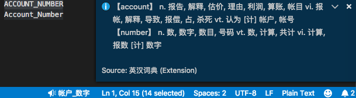

# 英汉词典使用说明

在状态栏中显示选中词的释义, 支持驼峰和下划线命名查询

## 功能

点击状态栏显示更全信息. 当选中单词时, 详细信息包括词形变化; 当选中驼峰或下划线命名时, 详细信息包括所有单词的释义, 但不包括各词的词形变化.

词典数据来源: https://github.com/skywind3000/ECDICT. 由于数据较大, 本机启动环境载入时需几秒. 之后的查询不需再次载入.

- 查询单词:

- 查询驼峰命名:

- 查询下划线命名:

- 查无结果:

## 版本说明

### 0.0.6

中文编程[知乎专栏](https://zhuanlan.zhihu.com/codeInChinese)文章: [VS Code英汉词典插件v0.0.6-改为TS实现, 加测试](https://zhuanlan.zhihu.com/p/51243255)
- 如命名中包含复数词汇, 取原型的释义. 如useColors, colors意为"国旗", 现改为取'color'释义.

### 0.0.4

中文编程[知乎专栏](https://zhuanlan.zhihu.com/codeInChinese)文章: [VS Code英汉词典插件v0.0.4-驼峰下划线命名](https://zhuanlan.zhihu.com/p/49133480)
- 对驼峰和下划线命名中所有单词进行直译
- 查词无结果时提示

### 0.0.1

中文编程[知乎专栏](https://zhuanlan.zhihu.com/codeInChinese)文章: [Visual Studio Code插件-英汉词典初版发布](https://zhuanlan.zhihu.com/p/48791726)

## 已知问题

[暂不支持带空格的短语查询](https://github.com/program-in-chinese/vscode_english_chinese_dictionary/issues/4)
