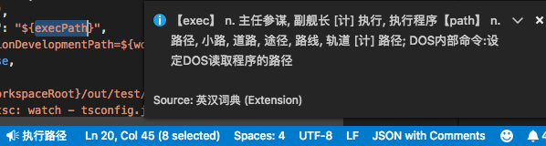
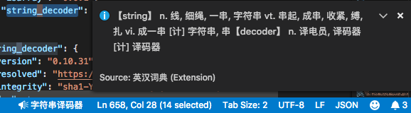

# EnglishChineseDictionary README

在状态栏中显示选中词或短语的释义, 支持驼峰和下划线命名查询

## Features

点击状态栏显示更全信息. 当选中单词时, 详细信息包括词形变化; 当选中驼峰或下划线命名时, 详细信息包括所有单词的释义, 但不包括各词的词形变化.

词典数据来源: https://github.com/skywind3000/ECDICT. 由于数据较大, 本机启动环境载入时需几秒. 之后的查询不需再次载入.
查询单词:

查询驼峰命名:

查询下划线命名:

查无结果:

## Release Notes

### 0.0.3

中文编程[知乎专栏](https://zhuanlan.zhihu.com/c_140193266)文章: [Visual Studio Code插件-英汉词典v0.0.3-支持驼峰和下划线命名]()
- 对驼峰和下划线命名中所有单词进行直译
- 查词无结果时提示

### 0.0.1

中文编程[知乎专栏](https://zhuanlan.zhihu.com/c_140193266)文章: [Visual Studio Code插件-英汉词典初版发布](https://zhuanlan.zhihu.com/p/48791726)

## Requirements

暂无

## Extension Settings

暂无

## Known Issues

暂无
